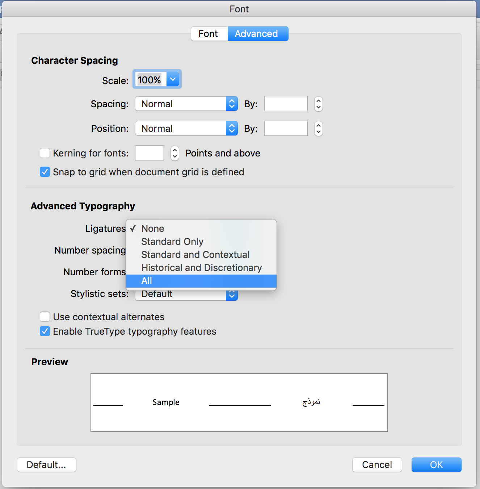

# 1 SINUHE (Sublime Input of Unicode for Hieroglyphic Egyptian) Project

Now we are integrating HieroJIS with Marwan Kilani's awesome font, which allows quadrat writing.

Development members are:
 * Marwan Kilani (Oxford)
 * So Miyagawa (Göttingen/Kyoto)
 * David Chapman (Sydney)

Executive Coach
 * Camilla Di Biase-Dyson

We would like to add you as a team member!

Toolkit for Coptic and Ancient Egyptian

# 2 Ruby tools and Coptic Pop-Up Dictionary for Mac

* Made by [So Miyagawa](https://uni-goettingen.academia.edu/SoMiyagawa)
* Tools made in ruby etc. for So's work on Coptic and Ancient Egyptian Digital Humanities
* Feel free to use, but almost no documentation. 
* Also, I did a small contribution to recode_coptic.pl 
 * (https://github.com/somiyagawa/converters_perl/blob/master/recode_coptic.pl)
 * It's really useful to convert texts made in old ASCII Coptic fonts into Coptic Unicode.
 * you can convert these ASCII fonts: "Coptic", "CopticLS", "CMCL", "NagHamadi", "avva_shenouda", "low"
 
 # 3 How to use it on WORD,
 
 * Please select all the letters, open the font window, and make all the ligature valid. 
 

 
# 3 HieroJIS: Hieroglyphic Unicode input using Japanese Input System

* Youtube videos: 
  * [general example](https://www.youtube.com/watch?v=qo5-_Y6cQY0) 
  * [how to install HieroJIS](https://www.youtube.com/watch?v=EAg2l6Wx7oA)
  * [some examples of Word-to-Word Conversion](https://www.youtube.com/watch?v=lFavuFI8HMU)
  * [some examples of English Word-to-Hieroglyphs Conversion]
  * [examples on Windows](https://www.youtube.com/watch?v=FOCwfL2f-TY)
* description slides
    * GitHub: (https://github.com/somiyagawa/toolkitForCopticAndAncientEgyptian/blob/master/An_intuitive_unicode_input_method_for_an%20(1).compressed.pdf)
* It is better than [Keyman](http://keyman.com/) on Windows, [KMFL](http://linux.lsdev.sil.org/wiki/index.php/Installing_KMFL_on_Ubuntu) on Linux or [Ukulele](http://scripts.sil.org/cms/scripts/page.php?site_id=nrsi&id=ukelele) on Mac.
* Using [Google Japanese Input](https://tools.google.com/dlpage/japaneseinput/eula.html?platform=win) currently, in the future it will use [Mozc](https://github.com/somiyagawa/mozc).
* 

